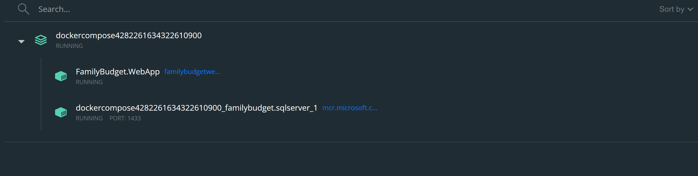
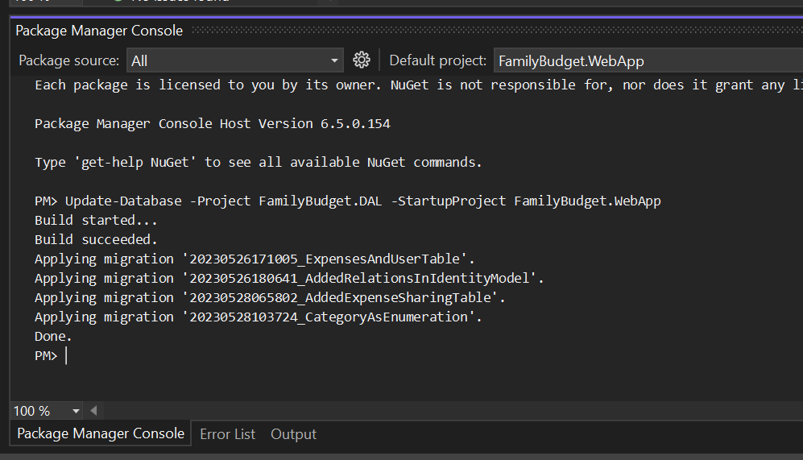

# FamilyBudget

After downloading this repository open solution in Visual Studio and select `docker-compose` as startup project.

It may take while to install all necessary images for SQL server and ASP.NET.

After all necessary installation is complete there should be two containers running:



After that step is coplete, go to Package Manager Console in Visual Studio and run following command

```
Update-Database -Project FamilyBudget.DAL -StartupProject FamilyBudget.WebApp
```

If everything went correctly, there should be below output in console:



Now application can be run in Visual Studio (F5).
